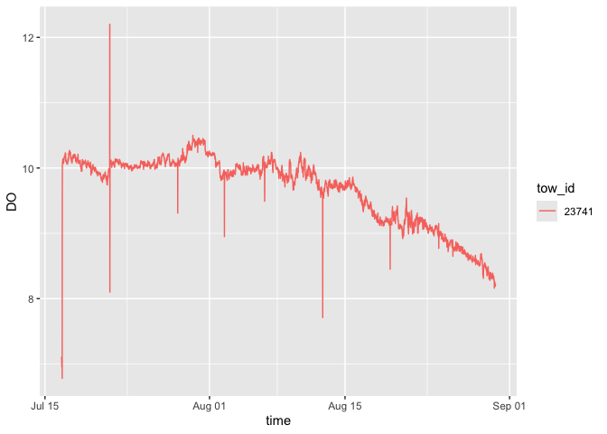
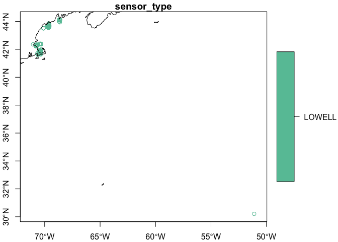

emolt
================

[eMOLT](https://erddap.emolt.net/erddap/info/index.html?page=1&itemsPerPage=1000)
data served via ERRDAP.

## Requirements

- [R v4.1+](https://www.r-project.org/)
- [httr](https://CRAN.R-project.org/package=httr)
- [dplyr](https://CRAN.R-project.org/package=dplyr)
- [readr](https://CRAN.R-project.org/package=readr)
- [sf](https://CRAN.R-project.org/package=sf)

## Installation

    remotes::install_github("BigelowLab/emolt")

## Initial Use

The premise of this package is that data may be stored in a single
location but accessed by many users. To achieve this resource-friendly
goal and still simplified access for each user, we need to inform the
package where the data resides. We do this by storing the path to the
data location in each user’s home directory in a hidden text file,
“~/.emolt”. That text file has just one line in it which contains the
full path to the shared dataset. For example, the author’s contains
`mnt/ecocast/coredata/emolt` which points to a shared network drive
mounted on our linux platform.

When the package is first loaded (ala `library(emolt)`) the existence of
the file is checked, and if missing a warning is issued.

You can create and populate that `~/.emolt` using a text editors, or you
can create using the provided function `set_data_path()`. Here is how
the author created his own…

    library(emolt)
    emolt::set_data_path("/mnt/ecocast/coredata/emolt)

That’s it. If you ever move the data you’ll have to modify the contents
of this hidden text file.

## Fetching Data

Once you have the hiddent file set up. It is easy to fetch the entire
dataset. It includes data going back a number of years with a file for
dissolved oxygen (`do`) and a file for temperature (`temp`)

``` r
suppressPackageStartupMessages({
  library(rnaturalearth)
  library(emolt)
  library(sf)
  library(ggplot2)
  library(dplyr)
})
```

A single function will fetch the entire dataset for DO and for
temperature. Accepting the default arguments places a gzipped CSV file
into your data directory under the `raw` subdirectory.

    fetch_do()
    fetch_temp()

We don’t know the update schedule, but for now assume monthly or a
longer interval. Updating your data may be best done by simply reruning
the `fetch_*` functions.

## Read the data

``` r
do <- read_emolt(what = "do", form = "raw")
do
```

    ## # A tibble: 579,642 × 9
    ##    tow_id time                latitude longitude temperature    DO DO_percentage
    ##    <chr>  <dttm>                 <dbl>     <dbl>       <dbl> <dbl>         <dbl>
    ##  1 136    2023-08-10 21:35:59     44.1     -68.7        26.6  7.76          96.6
    ##  2 136    2023-08-10 21:50:59     44.1     -68.7        25.6  7.98          97.6
    ##  3 136    2023-08-10 22:05:59     44.1     -68.7        27.2  7.77          98.0
    ##  4 136    2023-08-10 22:20:59     44.1     -68.7        26.8  7.82          98.0
    ##  5 136    2023-08-10 22:35:59     44.1     -68.7        26.2  7.92          98.0
    ##  6 136    2023-08-10 22:50:59     44.1     -68.7        25.6  8.01          98.1
    ##  7 136    2023-08-10 23:05:59     44.1     -68.7        25.0  8.1           98.0
    ##  8 136    2023-08-10 23:20:59     44.1     -68.7        24.4  8.2           98.2
    ##  9 136    2023-08-10 23:35:59     44.1     -68.7        23.8  8.26          97.8
    ## 10 136    2023-08-10 23:50:59     44.1     -68.7        23.2  8.36          97.8
    ## # ℹ 579,632 more rows
    ## # ℹ 2 more variables: water_detect_perc <dbl>, sensor_type <chr>

``` r
tow_id1 = dplyr::count(do, tow_id) |>
  dplyr::arrange(desc(n)) |>
  dplyr::slice(1) |>
  dplyr::pull(tow_id)
ggplot(data = filter(do, tow_id == tow_id1), 
       mapping = aes(x = time, y = DO, color = tow_id)) +
  geom_line()
```

<!-- -->

``` r
temp = read_emolt(what = "temp", form = "raw")
temp
```

    ## # A tibble: 12,240,640 × 8
    ##    tow_id segment_type  time                latitude longitude depth temperature
    ##    <chr>  <chr>         <dttm>                 <dbl>     <dbl> <dbl>       <dbl>
    ##  1 5      Profiling Do… 2023-08-01 15:59:50     43.9     -69.6   2.4        23.9
    ##  2 5      Profiling Do… 2023-08-01 15:59:51     43.9     -69.6   4.6        24.0
    ##  3 5      Profiling Do… 2023-08-01 15:59:52     43.9     -69.6   7.3        24.2
    ##  4 5      Profiling Do… 2023-08-01 15:59:53     43.9     -69.6  10.4        24.4
    ##  5 5      Profiling Do… 2023-08-01 15:59:54     43.9     -69.6  12.6        24.6
    ##  6 5      Profiling Do… 2023-08-01 15:59:55     43.9     -69.6  13.8        24.8
    ##  7 5      Profiling Do… 2023-08-01 15:59:56     43.9     -69.6  15.2        24.9
    ##  8 5      Profiling Do… 2023-08-01 15:59:58     43.9     -69.6  17.2        25.1
    ##  9 5      Profiling Do… 2023-08-01 16:00:03     43.9     -69.6  23.9        25.5
    ## 10 5      Profiling Do… 2023-08-01 16:00:04     43.9     -69.6  26.2        25.6
    ## # ℹ 12,240,630 more rows
    ## # ℹ 1 more variable: sensor_type <chr>

``` r
ggplot(data = filter(temp, tow_id == "5") ,
       mapping = aes(x = time, y = depth, color = temperature, shape = segment_type)) +
  geom_point() + 
  scale_y_reverse()
```

<!-- -->

## Cast as spatial data

``` r
dos = do |>
  filter(between(latitude,30, 50)) |>
  raw_as_sf() |>
  dplyr::group_by(tow_id) |>
  dplyr::slice_head(n=1)
```

``` r
coast = ne_coastline(scale = "medium", returnclass = "sf")
plot(dos['sensor_type'], axes = TRUE, pch = 1, reset = FALSE)
plot(st_geometry(coast), add = TRUE)
```

<!-- -->
